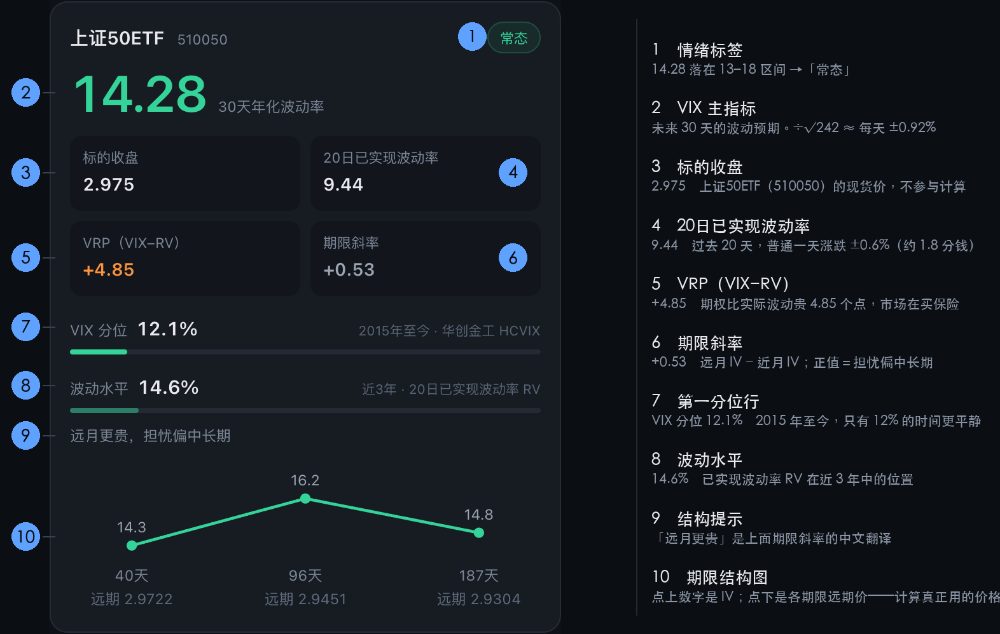
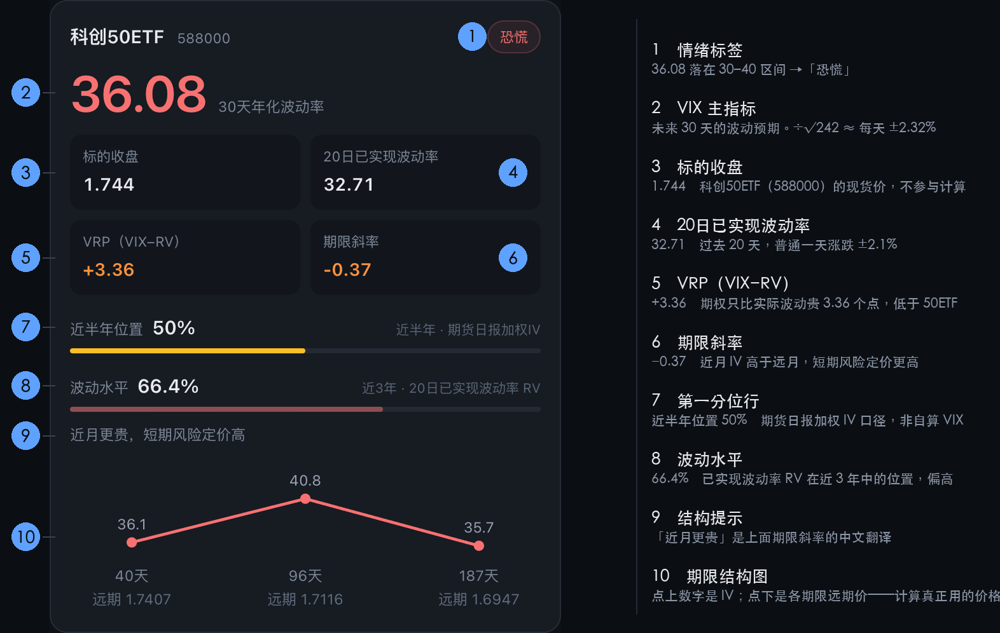
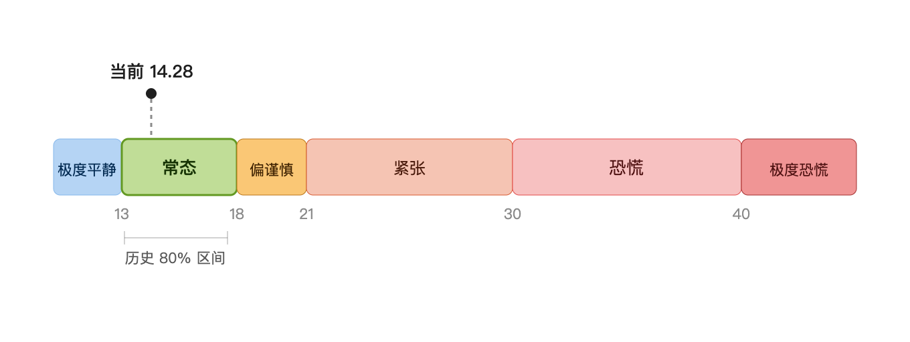

# A股波动率指数 VIX-A-SHERRY 指标解读

## 目录

- [一、实图标注](#一实图标注)
- [二、主指标：VIX](#二主指标vix)
- [三、VIX情绪标签](#三vix情绪标签)
- [四、期限结构图](#四期限结构图)
- [五、三个分位行](#五三个分位行)
- [六、速查表](#六速查表)

---

## 一、实图标注

下面两张是页面的真实截图，已标注每个指标。**建议先看图建立印象，再往下看逐项解释。**

### 上证50ETF —— 平静的一头



**一句话**：VIX 14.28 处在历史低位（12% 分位），但 VRP +4.85 说明期权并不便宜——市场虽然不慌，却仍在为保险多付钱。

### 科创50ETF —— 恐慌的一头



**一句话**：VIX 36.08，绝对水平是上证50 的 2.5 倍；但分位只有 50%——**对科创50 自己来说，这只是中位**。这正是「不能跨品种直接比绝对值」最好的例子。

---

### 图上 ③–⑥：四个统计格

#### ③ 标的收盘

**这张卡片对应的 ETF 在当日的收盘价**——不是期权合约的价，是现货的价。

| 卡片品种 | 这一格说的是哪只 ETF |
|---|---|
| 上证50ETF | **510050** |
| 沪深300ETF | **510300** |
| 中证500ETF | **510500** |
| 科创50ETF | **588000** |
| 创业板ETF | **159915** |

**它不是期权合约，所以没有这几个属性**：

- 没有**行权价**
- 没有**到期日**
- 不分**认购（call）/ 认沽（put）**

一张卡片背后是 4 个到期月、几十到上百个合约（9/18 的上证50ETF 有 96 个，科创50 有 170 个），它们**共享同一个标的**。「标的收盘」是整个卡片层面的一行，不属于任何一笔具体合约。

想看成单个合约的明细（哪个到期月、什么行权价、认购还是认沽），用 `chain` 命令。

**作用（它不参与计算，为什么还要显示）**：

1. **金额尺度** —— VIX 是个百分数，读者没有量级感。14.28% 换成「每天 ±0.92%」还是百分数；再乘 2.975，变成「每天 ±2.7 分钱」，你才知道这个波动落在多少钱上。
2. **平值锚点** —— 期权链里的行权价是 2.85 / 2.90 / 2.95 / 3.00 这样的整数档，判断哪个合约处在平值（ATM）要对着它看。而且你在任何行情软件里查到的 ETF 价格就是这个数，能对上。

**为什么计算不用它**：方差互换法必须用**远期价**——由 put-call 平价关系反推、消除了认购认沽方向性偏差的价。各期限实际使用的远期价就显示在卡片底部期限结构图的每个点下方（见第四节 4.3）。9/18 的上证50ETF：现货 2.975，而 10 月远期 2.9722、12 月 2.9451、次年 3 月 2.9304，逐月小幅下行（分红与资金成本造成的正常结构）。

**注意**：这是 **ETF 的价格，不是指数的点位**。50ETF 跟踪上证50指数，但 2.975 是 ETF 的价，指数是另一个数量级。

**一个可忽略的瑕疵**：严格说，第 1 条的金额尺度也该用远期价（2.9722 × 0.92% = 2.73 分，比按现货价算的 2.74 分低 0.1%）。用现货价，是因为一格里放不下三个到期月各自的远期价，而且它更直观、也能和行情软件对上。

#### ④ 20日已实现波动率（RV）

**过去 20 个交易日实际晃了多少**——先把「晃」说清楚：**晃 = 每天涨跌幅的大小，不是「总共涨跌了多少」**。

- 把过去 20 个交易日**每天的涨跌幅**（今收 vs 昨收）列出来，这 20 个数有正有负、有大有小
- RV 量的是这组数的**典型大小**（标准差）：数越大 = 忽上忽下越剧烈；数越小 = 每天只动一点点
- **它不看方向**：先跌 8% 再涨 14%，和每天稳稳涨 0.3%，20 天后终点差不多——但前者晃得远比后者厉害。**RV 量的是路径的颠簸程度，不是涨了多少**

算法：这 20 个日涨跌幅的标准差 × √当年实际交易天数（年化）。

**9.44 具体是什么意思**：年化 9.44% → 每天的典型涨跌幅 = 9.44% ÷ √242 ≈ **0.61%**。即过去 20 天里，普通的一天 50ETF 上下动 0.6% 左右（按 2.975 算约 1.8 分钱）。

> **口径说明**：年化因子用 A 股当年的实际交易日数（2026 年是 242 天）

**和 VIX 的关系**：

| | 方向 | 含义 |
|---|---|---|
| VIX | 向前看 | 市场**预期**未来晃多少 |
| RV | 回头看 | 过去**实际**晃了多少 |

「预期」和「实际」是两个不同的东西，不要混。

#### ⑤ VRP（VIX − RV）

**波动率风险溢价** = 隐含波动率 − 已实现波动率。

**读法**：

- **为正（常态）**：期权比实际波动贵。市场在买保险、愿意多付钱，卖方因此能收更高权利金。
- **为负（罕见）**：期权比实际波动便宜。通常出现在急跌之后——实际波动飙升，但市场预期会平复。

**中国市场 VRP 长期为正**，因为避险需求（尤其买认沽保护）推高了隐含波动率。今天五个品种全为正（+3.36 ~ +6.32），属正常状态。

**用途**：判断期权「贵不贵」。对期权卖方，VRP 为正意味着系统性优势。

#### ⑥ 期限斜率

**远月 IV − 近月 IV**，单位百分点。

**读法**：

- **正值**：远月比近月贵，市场更担忧中长期。
- **负值**：近月比远月贵，短期风险定价更高。**这是常态**——眼前的担忧总是更贵。

**今日**：

| 品种 | 斜率 | 含义 |
|---|---|---|
| 上证50ETF | **+0.53** | 远月更贵，担忧偏中长期 |
| 沪深300ETF | **+0.54** | 同上 |
| 中证500ETF | **+0.52** | 同上 |
| 创业板ETF | **−0.43** | 近月更贵，短期风险定价高 |
| 科创50ETF | **−0.37** | 同上 |

**这个分化很关键**：大盘蓝筹的斜率为正，成长股为负。说明**短期的紧张集中在成长股上**，而蓝筹的担忧反而落在更远的月份。

**注意**：斜率只取「最远月 − 最近月」两点相减，**它不反映中间的形状**——中间凸起要靠下面的图看。

---

## 二、主指标：VIX

### 2.1 它是什么

VIX 是**期权市场对未来 30 天波动率的预期**，年化百分比。

**它只预测「晃得凶不凶」，不预测「往哪晃」。** 这是最重要的认知——VIX 涨不代表要跌，只代表市场认为接下来会更颠簸。

### 2.2 怎么算出来的

三步：

1. **取当天的期权链** —— 所有挂牌合约的行权价、认购/认沽、收盘价。
2. **对每个到期月算方差** —— 只取虚值期权（OTM），按行权价的平方倒数（1/K²）加权积分。行权价离现价越远权重越小，平方倒数的设计让深虚合约的影响自然衰减。
3. **合成 30 天** —— 找出夹住 30 天的两个到期月，线性插值。如果最近可用的到期月已经超过 30 天，按编制方案直接取用，不插值。

### 2.3 怎么读

**核心换算**：VIX 除以 √当年实际交易天数，等于「每交易日的平均波动幅度」。

**为什么是 242**：

- **242 是 2026 年 A 股全年的实际交易日数**，确数，不是估算值。
- 交易日数 = 全年工作日扣除法定节假日休市（含调休安排）。A 股近年在 **242–245** 之间浮动——**2025 年是 243 天，2026 年是 242 天**。
- **不能用 252**：那是美股的惯例值，A 股不适用。套用会把每日波动**算小约 2%**（用 252 得 0.90%，用 242 得 0.92%）。
- **也不能跨年套用**：差 1 天就让结果差约 0.2%，回补历史数据时要用那一年的数值。
- 代码位置：`vix.py` 顶部的 `TRADING_DAYS_BY_YEAR` 映射表，按数据日期所在年份自动取值。**每年年底需补录下一年**。

以今天的上证50ETF 为例（2026 年按 242 个交易日计）：

```
VIX 14.28%  ÷  √242   ≈  0.92%
标的收盘 2.975  ×  0.92%  ≈  0.027 元
```

也就是说：**期权市场认为未来一个月，上证50ETF 每天平均上下晃 0.92%，约 ±2.7 分钱。**

### 2.4 什么时候会误导

- **不能横向直接比绝对高低。** 科创50 的 36 和上证50 的 14 看起来差很多，但科创50 的历史常态可能就是 30–40，36 只是「正常」。**要判断异常，得跟它自己的历史比**——这就是卡片底部「分位行」的作用。
- **不预测方向。** 低 VIX 不代表要涨，高 VIX 也不代表要跌。
- **低波动本身是风险。** VIX 长期压在低位，说明市场对下行风险毫无防备，一旦有意外容易放大。

### 2.5 今日五品种

| 品种 | VIX | 情绪 | 换算成日均波动 |
|---|---|---|---|
| 上证50ETF | 14.28 | 常态 | ±0.92% |
| 沪深300ETF | 16.44 | 常态 | ±1.06% |
| 中证500ETF | 23.97 | 紧张 | ±1.54% |
| 创业板ETF | 29.10 | 紧张 | ±1.87% |
| 科创50ETF | 36.08 | 恐慌 | ±2.32% |

**这条梯度本身就是信息**：从权重蓝筹到硬科技，波动预期逐级放大，说明当前的担忧集中在成长股那一头，不是全市场系统性紧张。

---

## 三、VIX情绪标签

### 3.1 分档表

| 区间 | 标签 |
|---|---|
| < 13 | 极度平静 |
| 13–18 | **常态** |
| 18–21 | 偏谨慎 |
| 21–30 | 紧张 |
| 30–40 | 恐慌 |
| ≥ 40 | 极度恐慌 |

### 3.2 依据

**不是照搬美股的 VIX 分档。** 依据是 A 股自己的实证数据——上交所官方波指 iVIX 停发前（2016-08 ~ 2018-02）的表现：

- 均值 **15.19**
- 全区间 **11.15 ~ 21.41**
- **80% 的时间落在 13.07 ~ 17.61**



所以「13–18」才是 A 股的家常便饭，标成「常态」。而美股体系里 12–16 常被叫「平静」，直接搬过来会把最常见的区间误标，真实的常态反被推向「中性」。

### 3.3 为什么用「常态」而不是「平静」

这两个词看着近，含义差很远：

- **「平静」是一个判断** —— 暗示"现在的波动低于正常水平"，读的人会顺着想"那是不是要变盘了"。
- **「常态」只是一个描述** —— 等于说"这个数字没什么值得解读的，它就在 A 股最普通的位置上"。

用「常态」正是为了**防止过度解读**。A 股历史上 80% 的时间就是这个水平，落进这一档本身不构成任何信号。

真正的信号出现在**离开这一档**的时候——「紧张」「恐慌」才值得看一眼，「常态」是背景音。

### 3.4 局限

- 这套阈值是 **2015–2018 年**校准的。此后市场大幅扩容——ETF 期权标的从 1 个增至 9 个（本工具覆盖其中 5 个），参与者结构也变了。
- 它是「更合理的参考」，**不是精确标准**。
- 真正的解法是用本工具自己的历史序列算滚动分位。

---

## 四、期限结构图

卡片底部的小折线图，三个点分别对应**三个不同到期时间的预期波动率**。

### 4.1 三个点是怎么来的

**不是随便选的 30/60/90 天**，而是**交易所实际挂牌的到期月**减去今天：

- 到期日 = **到期月的第四个星期三**（交易所规定），遇法定节假日顺延
- 所以剩余天数天然不是整数

以 2026-09-18 为例：

| 到期月 | 到期日 | 剩余天数 |
|---|---|---|
| 10 月 | 10-28 | 40 天 |
| 12 月 | 12-23 | 96 天 |
| 次年 3 月 | 03-24 | 187 天 |

（9 月合约剩余不足 7 天，按编制规则被剔除。）

### 4.2 怎么读

**三个点里通常只有第一个参与 VIX 计算。** 算 30 天 VIX 需要夹住 30 天的两个期限，而当最近可用期限已经超过 30 天时直接取用（不插值）。

**那后两个点有什么用？**

**看曲线的形状**：

- **单调上升**（近月便宜、远月贵）→ 市场担忧在更远处
- **单调下降**（近月贵）→ 短期风险定价高，常态
- **中间鼓包** → 市场对某一段特定时间（如跨年）最担忧

**形状提供的信息，是 VIX 那个单一数字给不了的。**

### 4.3 每个点下方那个「远期 x.xxxx」

那是**该期限计算方差时实际使用的价格**——不是标的现货价，而是从 put-call 平价关系反推出来的远期价 F。

**为什么必须显示它**：数值脱离输入就无法核对。把远期价摆出来，你才能拿它跟别人算的、或自己用期权链手算的结果对账。**卡片上唯一真正参与计算的价就是它**，藏起来不合理。

**它和「标的收盘」的关系**：现货 2.975，而三个期限的远期价分别是 2.9722 / 2.9451 / 2.9304，逐月小幅下行。差额来自分红与资金成本（`F = S × e^{rT} − 分红现值`）；50ETF 分红率不低，分红效应压过资金成本，所以远期价低于现货。

**为什么两个都放**：现货价只有一个数，适合当尺度和平值锚点；远期价随到期月变化，是三个数，用在核对。功能不同，不重复。

---

## 五、三个分位行

卡片底部有**两行**历史分位。第二行固定是「波动水平」，第一行则**按品种不同用不同来源**：

| 品种 | 第一行 | 第二行 |
|---|---|---|
| 上证50ETF / 沪深300ETF | VIX 分位（华创 HCVIX） | 波动水平（RV） |
| 中证500 / 科创50 / 创业板 | 近半年位置（期货日报） | 波动水平（RV） |

**为什么两套**：华创 HCVIX 只覆盖上证50 和沪深300，其余三个品种没有长期 IV 序列，只能用期货日报的加权 IV 作替代。两者在代码里互斥，保证每张卡片的分位行数一致。

### 5.1 VIX 分位（华创证券金工 HCVIX）

**含义**：当前 VIX 在 **2015 年至今**（约 2814 个交易日）历史分布中的位置。

**今日**：

- 上证50ETF **12.1%** —— 过去 11 年里，只有 12% 的时间比现在更平静
- 沪深300ETF **24.3%**

**读法**：分位越低，说明相对自己的历史越平静。**这是判断「异常与否」的正确方法**。

**口径注意**：用的是华创的编制口径，与本工具自算存在细节差异（300ETF 上实测约 1.3%）。所以这是「华创口径的历史位置」，不是「自算口径的历史位置」。

### 5.2 近半年位置（期货日报加权隐含波动率）

**含义**：当前加权 IV 在**近半年**（2026-03-25 至今，12 个观测）中的位置。

**今日**：

- 中证500ETF **82%** —— 近半年里偏贵
- 创业板ETF **55%** —— 中位
- 科创50ETF **50%** —— 中位

**口径注意（重要）**：这是**加权隐含波动率**，按成交加权、以平值附近合约为主，**数值系统性高于方差互换法算出的 VIX**。

**所以它只能用来判断「相对高低」，不能和卡片上的 VIX 数值直接比。**

**样本量也小**（只有 12 个观测），统计意义有限——看趋势可以，别当精确分位用。

### 5.3 波动水平（RV 分位）

**含义**：当前 20 日已实现波动率，在**近 3 年**（约 781 个交易日）中的位置。

**今日**：

- 上证50ETF **14.6%**、沪深300ETF **12.3%** —— 大盘的实际波动趴在低位
- 中证500ETF **42.2%**、创业板ETF **48.3%** —— 中位
- 科创50ETF **66.4%** —— 偏高

**口径注意**：这是 **RV（已实现波动率），不是 IV（隐含波动率）**。一个回头看、一个向前看，**不能当作「VIX 分位」使用**。

**它的价值**：给那三个没有 IV 历史序列的品种，提供一个「当前波动水平在历史上算高还是低」的参照。

### 5.4 三种分位对照

| | VIX 分位 | 近半年位置 | 波动水平 |
|---|---|---|---|
| 数据 | 隐含波动率 IV | 加权隐含波动率 | 已实现波动率 RV |
| 方向 | 向前看 | 向前看 | 回头看 |
| 时间跨度 | 2015 年至今（2814 天） | 近半年（12 个点） | 近 3 年（781 天） |
| 覆盖 | 仅 50ETF / 300ETF | 三个成长品种 | 全部 |
| 来源 | 华创证券金工 | 期货日报 | 腾讯日线自算 |

### 5.5 怎么选：先分清「预期」还是「实际」

**别三个一起比**，但也别不知道该看哪个。判断标准只有一条——**你想回答什么问题**。

| 行 | 回答什么问题 | 方向 |
|---|---|---|
| **第一行**（VIX 分位 / 近半年位置） | 市场**预期**未来晃多少？这个预期在自己的历史上偏贵还是偏便宜？ | 向前看 |
| **第二行**（波动水平） | 过去 20 天**实际**晃了多少？这个水平在历史上算高还是低？ | 回头看 |

- **关心情绪、风险定价、要不要买保险** → 看**第一行**
- **关心实际波动、行情有多剧烈** → 看**第二行**

第一行内部谁用哪个来源，**你不需要选**——代码按品种定好了：50ETF / 300ETF 用 VIX 分位（11 年历史，最可靠），其余三个用近半年位置（没有更长的 IV 序列可用）。

#### 什么时候两行一起看

只有一种情形：**判断「预期和实际是否背离」**。

| 组合 | 含义 |
|---|---|
| 第一行高 + 第二行低 | 市场在为**还没发生**的风险付钱——预期远高于现实 |
| 第一行低 + 第二行高 | 市场对**已经发生**的波动定价不足 |
| 两行都低 | 双低，最平静，也最容易出意外 |
| 两行都高 | 已经慌了，且市场预期还会继续慌 |

#### 不要做的事

**别拿第一行和第二行的数字直接比大小**（比如「14.9% 比 12.1% 高，所以……」）。它们口径不同——一个是 IV 一个是 RV，时间跨度一个是 11 年一个是 3 年。两个百分数摆在一起很自然想比，但比出来的差异没有意义。

---

## 六、速查表

| 指标 | 一句话 | 关键限制 |
|---|---|---|
| **VIX** | 未来 30 天的年化波动预期；÷√当年实际交易天数 = 日均波动 | 不预测方向；不能跨品种直接比 |
| **情绪标签** | VIX 的档位标签 | 阈值是 2015–2018 校准的，参考性大于精确性 |
| **标的收盘** | 期权标的 ETF 的价格 | 是 ETF 价格，不是指数点位 |
| **RV** | 过去 20 天实际波动 | 回头看，不是预期 |
| **VRP** | 期权比实际波动贵多少 | 长期为正，转负是急跌信号 |
| **期限斜率** | 远月 IV − 近月 IV | 只取首尾两点，不反映中间形状 |
| **期限结构图** | 三个到期月的 IV 曲线 | 只有第一个参与 VIX 计算 |
| **VIX 分位** | 在 2015 年至今的位置 | 华创口径；仅 50/300 有 |
| **近半年位置** | 近半年的相对高低 | 加权 IV 口径，数值偏高；仅 12 个观测 |
| **波动水平** | 在近 3 年的位置 | RV 口径，**不等于 VIX 分位** |

---

## 附：数据来源与口径

| 用途 | 来源 |
|---|---|
| 上交所期权链 | `query.sse.com.cn` 官方接口 |
| 深交所期权链 | 深交所官方报表接口 + 新浪财经行情 |
| 已实现波动率 | 腾讯财经日线 |
| 长期 IV 参照 | 华创证券金工 HCVIX |
| 近半年加权 IV | 期货日报「期权市场」日报 |
